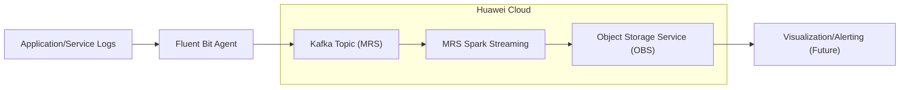

# Real-time Log Analysis Pipeline on Huawei Cloud

## Description

This project implements a real-time log analysis pipeline on Huawei Cloud, designed for rapid deployment and functionality as an MVP. It leverages Fluent Bit for log collection, Kafka (via MRS) for message queuing, and MRS Spark for real-time processing. The processed data is stored in Object Storage Service (OBS).

## Architecture

The pipeline follows this architecture:



## Components

*   **Fluent Bit:** A lightweight and highly scalable Log Collector.  It's configured to tail log files and forward them to a Kafka topic.
*   **Kafka (MRS):** A distributed streaming platform used as a message queue. It decouples log producers and consumers.
*   **MRS Spark Streaming:** A real-time data processing engine.  It consumes data from Kafka, performs aggregations, and stores the results in OBS.
*   **Object Storage Service (OBS):** Huawei Cloud's object storage service. Used for storing processed log data.

## Setup

1.  Install Docker and Docker Compose.
2.  Clone this repository.
3.  Create a `fluentbit` directory with a `fluent-bit.conf` file (see example below).
4.  Run `docker-compose up -d` to start the pipeline.

**Example `fluentbit/fluent-bit.conf`:**

```
[SERVICE]
    Flush        1
    Log_Level    info
    Daemon       off
    Parsers_File parsers.conf

[INPUT]
    Name         tail
    Path         /path/to/your/logs/*.log
    Parser       json
    Tag          application.log

[OUTPUT]
    Name  kafka
    Match application.*
    Brokers ${KAFKA_BROKER_LIST}
    Topic   logs
```

**Note:** Replace `/path/to/your/logs/*.log` with the actual path to your application logs and adjust the `parsers.conf` file as needed for your log format.

## Configuration

*   **Fluent Bit:** Configure the `fluent-bit.conf` file to specify log sources and Kafka broker details.
*   **Kafka (MRS):** Ensure an MRS Kafka cluster is provisioned and accessible.
*   **MRS Spark Streaming:** Develop and deploy a Spark Streaming application to process data from the Kafka topic and store it in OBS.

## Future Enhancements

*   Implement a data visualization dashboard (e.g., Grafana) to monitor log data.
*   Integrate an alerting system to notify operators of critical events.
*   Enhance the Spark Streaming application to perform more sophisticated log analysis (e.g., anomaly detection).
